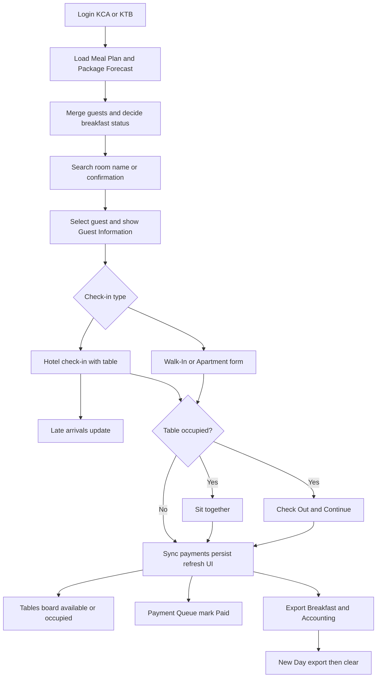

# Business Requirements Document (BRD)

## Breakfast Check-in System

| Field | Value |
| --- | --- |
| Product name | Breakfast Check-in |
| Document type | Business / Functional / Technical BRD |
| Audience | Software engineers, QA, product owners, AI coding agents |
| Purpose | Complete rebuild reference from zero |
| Language | English |
| Current live deployment | `https://phpcoder7.github.io/breakfast/` |
| Implementation basis | Current production codebase in this repository |
| Status legend | **REQ** = required product behavior · **IMPL** = current implementation fact · **GAP** = known mismatch / risk |

---

## 1. Document control and purpose

### 1.1 Purpose
This BRD defines the complete business, functional, data, UX, and technical specification of the Breakfast Check-in application so that any programmer or AI agent can rebuild an equivalent system without reverse-engineering the code.

### 1.2 Scope
In scope:
- Offline-capable restaurant host station for breakfast service
- Two-property branding (KCA / KTB)
- Daily OPERA XML import and guest merge
- Guest search, check-in, late arrivals, checkout
- Table availability / shared seating
- Payment queue and Excel exports
- Browser persistence for one operating day
- Static deployment (local folder and GitHub Pages)

Out of scope (current product):
- Backend server, database, or API
- Secure enterprise authentication / SSO
- Multi-device real-time sync
- Guest PMS write-back to OPERA
- Automated billing / POS payment capture
- Multi-language UI

### 1.3 Intended readers
- Engineers rebuilding or extending the app
- AI agents generating an equivalent codebase
- QA writing acceptance tests
- Operations / Front Office reviewing business rules

### 1.4 Terminology

| Term | Meaning |
| --- | --- |
| Host | Restaurant staff using the station |
| FO | Front Office |
| Meal Plan XML | Daily OPERA meal-plan report |
| Package Forecast XML | Daily OPERA package/product forecast |
| Guest | Merged searchable hotel reservation record |
| Check-in record | One breakfast seating event for a room/party |
| Payment queue | Derived list of chargeable check-ins |
| Included | Breakfast covered by package / meal plan |
| Payment | Breakfast must be charged |
| Unknown | Package not recognized |
| Entitlement | Number of included breakfast covers |
| Late arrival | Additional guests joining an already active check-in |
| Operating day | Calendar day key `YYYY-MM-DD` used for state validity |
| Brand / property | KCA or KTB login identity |

### 1.5 Product objectives
1. Enable fast breakfast check-in at the restaurant host station.
2. Decide breakfast entitlement from OPERA Meal Plan + Package Forecast.
3. Track seated guests by table in real time.
4. Maintain a payment queue for chargeable covers.
5. Export operational and accounting Excel reports.
6. Work without a backend and support offline / local file use.

### 1.6 Assumptions
- Hosts use Chrome or Edge on Windows tablets/PCs.
- Daily XML files are exported from OPERA in the supported formats.
- One station browser profile is used per property during service.
- Credentials are station convenience credentials, not high-security auth.
- Table lists are configured per brand in text files and bundled into the app.

---

## 2. Business context and users

### 2.1 Properties
The application serves two hotel brands/properties:

| Username | Password | Logo | Table config file |
| --- | --- | --- | --- |
| `KCA` | `KCAadmin` | `assets/logos/kca.svg` | `tables-kca.txt` |
| `KTB` | `KTBadmin` | `assets/logos/ktb.svg` | `tables-ktb.txt` |

**IMPL:** Username is trimmed and uppercased; password is exact and case-sensitive.  
**IMPL:** Auth is stored in `sessionStorage` key `breakfast-auth-user`.  
**GAP:** Operational `localStorage` state is global (not brand-scoped). Logging into the other brand on the same browser can show the previous brand’s guests/check-ins.

### 2.2 Roles

| Role | Capabilities |
| --- | --- |
| Restaurant host | Load XML, search, check in, manage tables, mark paid, export |
| Front Office override | Manual guest entry and Correct Status when OPERA data is wrong |

There is no role hierarchy beyond brand login; both accounts have full station features.

### 2.3 Daily operating lifecycle
1. Host signs in.
2. Host loads Meal Plan XML and Package Forecast XML.
3. Host searches rooms and checks guests into tables.
4. Host manages late arrivals, shared tables, checkout, and payments.
5. Host exports reports as needed.
6. Host starts **New Day** to download both reports and clear the day.

### 2.4 Privacy constraints
- Daily OPERA XML files contain guest PII and must not be committed to git.
- Persisted browser state also contains guest PII for the current day.
- Credentials are visible in frontend source and must not be treated as secure internet auth.

---

## 3. Functional requirements

### 3.1 Authentication and branding

| ID | Requirement |
| --- | --- |
| FR-AUTH-01 | System shall present a login screen before the main app. |
| FR-AUTH-02 | System shall accept only configured brand credentials. |
| FR-AUTH-03 | Successful login shall store the brand username for the browser session. |
| FR-AUTH-04 | Logout shall clear session auth and return to login. |
| FR-AUTH-05 | Brand logo and table list shall be selected from the logged-in user. |
| FR-AUTH-06 | Logout shall not automatically clear operational day data. |

### 3.2 XML import

| ID | Requirement |
| --- | --- |
| FR-XML-01 | Host can upload Meal Plan XML via file picker. |
| FR-XML-02 | Host can upload Package Forecast XML via file picker. |
| FR-XML-03 | Invalid XML, wrong root, missing required columns, or empty rows shall be rejected with an error message. |
| FR-XML-04 | Successful load shall mark the file as Loaded and store its filename. |
| FR-XML-05 | Hotel search/check-in shall remain disabled until both files are loaded, unless an FO override guest is selected. |
| FR-XML-06 | When both files are present, system shall merge them into searchable guests and persist state. |

### 3.3 Search and Guest Information

| ID | Requirement |
| --- | --- |
| FR-SEARCH-01 | Search shall match room number, first/last/full name, and confirmation number. |
| FR-SEARCH-02 | Search shall be case-insensitive substring matching; room match shall ignore leading zeros. |
| FR-SEARCH-03 | Search shall show at most 8 results. |
| FR-SEARCH-04 | Arrow keys shall navigate results; Enter shall select exact room match if present, else highlighted/first result. |
| FR-SEARCH-05 | Selecting a guest shall render Guest Information and activate Check In. |
| FR-SEARCH-06 | Guest Information shall show room, name, adults, children, meal plan/package, arrival, departure, BF qty, status badge, and Correct Status. |
| FR-SEARCH-07 | Recent rooms (max 6, in-memory only) shall be available as quick chips. |

### 3.4 Check-in types

| ID | Requirement |
| --- | --- |
| FR-CI-01 | Hotel check-in requires selected guest + table number. |
| FR-CI-02 | Actual guests defaults to adults + children when blank. |
| FR-CI-03 | If actual guests exceed breakfast entitlement for included status, host must confirm before continuing. |
| FR-CI-04 | Active hotel check-in for the same room shall open Late Arrivals instead of creating a duplicate. |
| FR-CI-05 | After checkout, the same room may check in again as a new record. |
| FR-CI-06 | Walk-In check-in captures name, adults, children, table; always payment required. |
| FR-CI-07 | Apartment check-in captures apartment number, name, adults, children, table; always payment required; unit price AED 120. |
| FR-CI-08 | Manual Guest (FO) can create/replace a hotel guest and set status/qty even when XMLs are not loaded. |
| FR-CI-09 | Correct Status can override breakfast status, qty, and meal-plan note for the selected guest. |

### 3.5 Payments

| ID | Requirement |
| --- | --- |
| FR-PAY-01 | Payment queue shall include Walk-In, Apartment, hotel `payment` status, and entitlement overruns. |
| FR-PAY-02 | Standard unit price = AED 150; Apartment unit price = AED 120. |
| FR-PAY-03 | Entitlement overrun charges only `extraGuests`; other payment cases charge actual guests (fallback adults+children). |
| FR-PAY-04 | Paid button marks the record paid immediately with timestamp; no confirm/undo. |
| FR-PAY-05 | Payment cards show reason and unpaid/paid state; prices appear in accounting export, not on cards. |
| FR-PAY-06 | Queue sorts unpaid first, then newest first. |

**GAP vs older README:** `unknown` status alone does **not** enter the payment queue in current code.

### 3.6 Late arrivals

| ID | Requirement |
| --- | --- |
| FR-LATE-01 | Late arrivals can be started from duplicate hotel check-in flow or Guests button on Today’s Check-ins card. |
| FR-LATE-02 | Host enters additional guests (>= 1). |
| FR-LATE-03 | System adds to `actualGuests`, recalculates extras/entitlement, optionally updates table. |
| FR-LATE-04 | Paid status resets to unpaid when late arrivals are applied. |

### 3.7 Tables, shared seating, checkout

| ID | Requirement |
| --- | --- |
| FR-TBL-01 | Table identity is case-insensitive and space-insensitive. |
| FR-TBL-02 | Assigning an occupied table prompts: Cancel / Sit together / Check Out & Continue. |
| FR-TBL-03 | Sit together leaves existing parties active and continues. |
| FR-TBL-04 | Check Out & Continue checks out all active occupants on that table, then continues. |
| FR-TBL-05 | Tables tab (after Payment Queue) shows configured brand tables as Available (green) or Occupied (red). |
| FR-TBL-06 | Available table click pre-fills Check In table number and focuses search. |
| FR-TBL-07 | Occupied table click shows read-only occupant list (room, name, guest count). |
| FR-TBL-08 | Host can change table number from Today’s Check-ins and Payment Queue cards. |
| FR-TBL-09 | Check Out from Today’s Check-ins requires confirmation and sets `checkedOut` + `checkedOutAt`. |
| FR-TBL-10 | Checked-out records remain in history/export; table becomes free for new seating. |

### 3.8 Today’s Check-ins

| ID | Requirement |
| --- | --- |
| FR-TODAY-01 | Cards show time, room, name, status/badge, table, guest count, guest type. |
| FR-TODAY-02 | Active cards support Change Table, Add Guests (late arrivals), Check Out. |
| FR-TODAY-03 | Checked-out cards are muted, show Out time, and disable table/guest edits. |
| FR-TODAY-04 | Separate filters: table number only; room or guest name. |
| FR-TODAY-05 | Card click (outside action buttons) shows Guest Information. |
| FR-TODAY-06 | Dashboard statistics remain based on full day list, not filtered results. |

### 3.9 New Day and exports

| ID | Requirement |
| --- | --- |
| FR-DAY-01 | New Day confirms, then downloads Breakfast Report and Accounting Report. |
| FR-DAY-02 | If either export fails, day clear is cancelled. |
| FR-DAY-03 | Successful New Day clears check-ins, payments, guests, XML raw data/flags, searches, and form fields; auth remains. |
| FR-EXP-01 | Host can export Breakfast Report independently. |
| FR-EXP-02 | Host can export Accounting Report independently. |

---

## 4. Business rules

### 4.1 Breakfast package codes

Included codes (`BREAKFAST_CODES`):

| Code | Description |
| --- | --- |
| `BFAAD` | Breakfast Adult Add On Package |
| `BFAIN` | Breakfast Adult Included in Rate |
| `BFCAD` | Breakfast Child Add On Package |
| `BFCIN` | Breakfast Child Included in Rate |
| `UPSBB1` | Breakfast 1 Person |
| `WEB_BFSA` | Breakfast Adult |
| `BB` | Breakfast Package |
| `CLB` | Club Lounge (Breakfast Included) |

Payment codes (`NO_BREAKFAST_CODES`):

| Code | Description |
| --- | --- |
| `RO` | Room Only |

### 4.2 Status decision precedence
1. Meal plan `RO` => `payment` (even if breakfast products exist).
2. Else if meal plan or any product is an included breakfast code => `included`.
3. Else if any meal/product code exists => `unknown`.
4. Else => `unknown`.

### 4.3 Entitlement quantity
For `included` guests:
- Prefer aggregated breakfast package quantity when > 0.
- Else default to `adults + children`.

Extra guests formula:
```text
extraGuests = max(0, actualGuests - breakfastQuantity)
entitlementExceeded = (breakfastStatus == included) AND (extraGuests > 0)
```

### 4.4 Pricing

| Case | Unit price | Chargeable qty |
| --- | --- | --- |
| Apartment | AED 120 | actual guests (or adults+children) |
| Walk-In / hotel payment | AED 150 | actual guests (or adults+children) |
| Entitlement overrun | AED 150 | `extraGuests` only |

### 4.5 Duplicate room rule
- Active hotel check-in for same normalized room => Late Arrivals flow.
- Checked-out hotel room is not considered active; a new check-in is allowed.

### 4.6 Table occupancy
- Occupied = at least one check-in with same normalized table and `checkedOut !== true`.
- Multiple active parties may share one table (Sit together).
- Configured table board lists only brand tables; free-text table numbers are still accepted for check-in.

### 4.7 Payment sync
Payment list is always regenerated from check-ins via `syncPaymentList`:
- Filter with `requiresPayment`
- Map to payment records
- Sort unpaid first, then newest timestamp

### 4.8 Checkout history
Checkout does not delete the check-in. It frees the table and keeps the record for Today’s Check-ins and Breakfast Report. Payment queue entries remain for collection/accounting.

---

## 5. Data specification

### 5.1 Persistence keys

| Store | Key | Contents |
| --- | --- | --- |
| `sessionStorage` | `breakfast-auth-user` | Brand username (`KCA` / `KTB`) |
| `localStorage` | `breakfast-checkin-state` | Full operating-day snapshot |

Snapshot is loaded only when `serviceDate === today (YYYY-MM-DD)`. Older snapshots are ignored (not auto-exported or deleted).

### 5.2 Persisted state shape
```json
{
  "guests": [],
  "checkIns": [],
  "paymentList": [],
  "filesLoaded": { "mealPlan": false, "packageForecast": false },
  "fileNames": { "mealPlan": "", "packageForecast": "" },
  "rawData": { "mealPlan": [], "packageForecast": [] },
  "serviceDate": "YYYY-MM-DD"
}
```

### 5.3 Transient (not persisted)
- Selected guest
- Search results / active index
- Recent rooms
- Active tab / mobile view
- Open modal / tools panel
- Current form field values

### 5.4 Guest object
| Field | Type | Notes |
| --- | --- | --- |
| `id` | string | Generated |
| `roomNumber` | string | Normalized |
| `firstName` / `lastName` / `fullName` | string | |
| `arrival` / `departure` | string | Source date formats preserved / displayed formatted |
| `adults` / `children` | number | |
| `confirmationNumber` | string | |
| `mealPlan` | string | Code |
| `products` | string[] | Codes |
| `productDescriptions` | string[] | |
| `packageQuantity` | number | |
| `reservationStatus` | string | Captured; not used to filter |
| `rateCode` | string | |
| `breakfastIncluded` | boolean | |
| `breakfastStatus` | `included` \| `payment` \| `unknown` | |
| `breakfastQuantity` | number | Entitlement |
| `guestType` | `Hotel` | Manual/FO also Hotel |
| `statusOverride` | boolean | FO correction marker |

### 5.5 Check-in record
| Field | Type | Notes |
| --- | --- | --- |
| `id` | string | Shared with payment id |
| `timestamp` | ISO string | |
| `timeLabel` | locale time | |
| `roomNumber` | string | Or `Walk-In` / `APT {n}` |
| `guestName` | string | |
| `adults` / `children` | number | |
| `tableNumber` | string | |
| `mealPlan` / `products` | string | |
| `breakfastStatus` | string | |
| `actualGuests` | number | |
| `guestType` | Hotel / Walk-In / Apartment | |
| `confirmationNumber` | string | |
| `discount` | string | Apartment stores `20%` |
| `entitlementExceeded` | boolean | |
| `extraGuests` | number | |
| `breakfastQuantity` | number | |
| `statusOverride` | boolean | |
| `paid` / `paidAt` | boolean / ISO | |
| `checkedOut` / `checkedOutAt` | boolean / ISO | Optional until checkout |
| `lateArrivalAdded` | number | Optional after late arrivals |

### 5.6 Payment record
| Field | Type | Notes |
| --- | --- | --- |
| `id` | string | Same as check-in id |
| `timestamp` | ISO | |
| `displayLocation` | string | Room / Walk-In / APT |
| `guestName` | string | |
| `tableNumber` | string | |
| `guestType` | string | |
| `reason` | string | Human-readable |
| `extraGuests` | number | |
| `entitlementExceeded` | boolean | |
| `chargeableGuests` | number | |
| `unitPriceAed` | number | 150 or 120 |
| `amountAed` | number | qty * unit |
| `paid` / `paidAt` | boolean / ISO | |

---

## 6. Input / output contracts

### 6.1 Meal Plan XML
- Required root local name: `RS`
- Rows in namespace `urn:schemas-microsoft-com:xml-analysis:rowset`, element `R`
- Column map inferred from embedded XSD elements + `saw-sql:columnHeading`
- Required mapped headings: Room, Confirmation, Meal Plan
- Also mapped when present: First/Last name, Arrival, Departure, Adults, Children
- Output rows include `source: "mealPlan"`

Reject when:
- Not parseable XML
- Wrong root
- Missing required columns
- No data rows

### 6.2 Package Forecast XML
- Required root local name: `PKGFORECAST`
- Reservation blocks: `G_RESV_DETAILS`
- Product group ancestor: `G_PRODUCT_GROUP`
- Key fields: `CONFIRMATION_NO`, `ROOM`, name fields, `PRODUCTS`, `PRODUCT_ID1`, `PRODUCT_DESC`, qty fields, adults/children, status, arrival/departure, `RATE_CODE`
- `PRODUCTS` comma-separated, normalized uppercase
- Output rows include `source: "packageForecast"`
- Reservation status is stored but not filtered

### 6.3 Merge contract
1. Aggregate forecast by confirmation and by room.
2. For each Meal Plan row, match confirmation first, else room.
3. Meal Plan values generally win for identity/occupancy/meal plan; package fills products/descriptions/qty.
4. Unmatched forecast reservations become searchable hotel guests.
5. Breakfast status decided by section 4.2.

### 6.4 Table config files
- Files: `tables-kca.txt`, `tables-ktb.txt`
- Format: comma-separated table numbers on one line
- Parsed: trim, drop blanks, case-insensitive dedupe, preserve order
- Bundled into `app.bundle.js` via esbuild text loader
- Current KTB example:
  `1,2,3,5,6,20,21,22,23,24,25,30,31,32,33,34,35,36,40,41,42,43,50,51,52,53,54,55,56,57,58,60,70`
- **IMPL/GAP:** `tables-kca.txt` may be empty; KCA Tables board then shows no configured tables.

### 6.5 Excel outputs

#### Breakfast Report
- Filename: `breakfast-report-YYYY-MM-DD.xlsx`
- Sheet: `Breakfast Report`
- Columns:
  - Time
  - Room Number
  - Guest Name
  - Adults
  - Children
  - Table
  - Meal Plan
  - Package
  - Breakfast Included (`Yes`/`No`)
  - Guest Type
  - FO Override (`Yes`/`No`)
  - Checked Out (`Yes`/`No`)
  - Check Out Time

Includes all check-ins (active and checked out).

#### Accounting Report
- Filename: `breakfast-accounting-YYYY-MM-DD.xlsx`
- Sheet: `Accounting`
- Columns:
  - Time
  - Room / Apartment
  - Guest
  - Table
  - Guest Type
  - Reason
  - Extra Guests
  - Guests Charged
  - Unit Price (AED)
  - Amount (AED)
  - Paid
  - Paid At

Includes paid and unpaid payment-queue rows.

---

## 7. UX specification

### 7.1 Screens
1. **Login** — username, password, brand logo, error banner
2. **Main shell**
   - Header: XML loaders/status, New Day, user, logout, exports/tools
   - Left: Room Search + Guest Information
   - Right tabs: Check In | Today’s Check-ins | Payment Queue | Tables

### 7.2 Responsive behavior
- Desktop/tablet (`md+`): two-column workspace; desktop tabs visible
- Header tools collapse into Tools menu until `xl`
- Phone (`<768px`): five-item bottom nav (Search, Check In, Today, Pay, Tables); one side visible at a time
- Landscape/iPad height compression and safe-area/`100dvh` support

### 7.3 Status colors
| Color | Meaning |
| --- | --- |
| Blue | Active tab / info |
| Green | Included, success, loaded, available table, paid |
| Red | Payment required, error, missing file, occupied table, unpaid |
| Yellow/Amber | Unknown package, warning, loading, FO override note |
| Orange | Apartment status |
| Gray | Disabled / checked-out |

### 7.4 Cards and actions

**Today’s Check-ins card**
- Actions: Change Table, Guests (+ late arrivals), Check Out
- Body click => Guest Information
- Checked-out: muted, Out HH:MM:SS, read-only guest count

**Payment card**
- Unpaid: red + Paid button
- Paid: green badge
- Table editable in both states
- Body click => Guest Information

**Tables board card**
- Green Available / Red Occupied
- Counts Available / Occupied
- Available click => prefill table + Check In
- Occupied click => occupants modal

### 7.5 Modals
Reusable modal supports:
- Confirm (danger/primary)
- Choice (multi-button)
- Dynamic forms

Close via X or Escape; focus returns to search in many flows.  
**GAP:** Closing some promise-based prompts via X/Escape may leave the awaiting Promise unresolved.

### 7.6 Keyboard
- Search typing filters instantly
- Up/Down navigate results
- Enter selects guest
- Enter on table completes hotel check-in when table filled
- Escape closes modal

### 7.7 Empty / error states
- Empty guest panel before selection
- No check-ins / no matching check-ins
- No payment items
- No restaurant tables configured for property
- File load/parse errors shown in message banner

---

## 8. Technical reference

### 8.1 Architecture
Static, backend-free SPA:
- Browser executes `js/app.bundle.js` (IIFE)
- Maintainable sources are ES modules under `js/`
- UI: `index.html` + Tailwind CDN utilities + `style.css`
- Excel: local SheetJS `vendor/xlsx.full.min.js`
- Icons: local Font Awesome under `vendor/fontawesome/`

### 8.2 Source modules

| File | Responsibility |
| --- | --- |
| `js/app.js` | App orchestration, events, workflows |
| `js/auth.js` | Login/logout/session brand |
| `js/xmlParser.js` | Meal Plan + Package Forecast parsers |
| `js/mergeData.js` | Merge + breakfast decision |
| `js/search.js` | Guest search |
| `js/checkin.js` | Check-in/late arrivals/checkout/table helpers |
| `js/payment.js` | Payment derivation and paid marking |
| `js/export.js` | Excel reports |
| `js/ui.js` | Rendering, tabs, modals, cards |
| `js/tables.js` | Brand table lists |
| `js/utils.js` | Constants, normalization, storage, formatting |

### 8.3 Build
After any `js/` or `tables-*.txt` change:

```bash
npx esbuild js/app.js --bundle --format=iife --loader:.txt=text --outfile=js/app.bundle.js
```

Also bump `CACHE_NAME` in `service-worker.js` when shipping to GitHub Pages.

**IMPL:** No `package.json`, lockfile, or CI rebuild. Bundle must be committed manually.

### 8.4 Offline / `file://`
- Bundle avoids ES-module CORS/module blocks on `file://`
- XML uses local file inputs (`File.text()`), no server needed
- Service worker is disabled on `file://`
- **GAP:** Tailwind CDN and Google Fonts need network on first cold load; custom `style.css` alone does not reproduce all Tailwind utilities

### 8.5 PWA / service worker
- `manifest.webmanifest` relative start/scope
- `service-worker.js` network-first with cache fallback
- Precaches shell, bundle, SheetJS, FA CSS, logos, favicon
- Manual cache version string (example current: `breakfast-checkin-v14`)

### 8.6 Deployment
- GitHub Actions workflow `.github/workflows/pages.yml`
- Deploys repository root on push to `main` (no build/test step)
- `.nojekyll` present
- `.gitignore` ignores `*.xml` / `*.XML`

---

## 9. Non-functional requirements

| ID | Category | Requirement |
| --- | --- | --- |
| NFR-01 | Performance | Instant local search and card filter while typing on host tablets |
| NFR-02 | Reliability | Persist after every successful mutating action |
| NFR-03 | Compatibility | Latest Chrome/Edge desktop and tablet |
| NFR-04 | Offline | Core JS/data path works from local folder; HTTPS for PWA install |
| NFR-05 | Privacy | Do not publish daily XML guest files |
| NFR-06 | Security | Treat credentials as station convenience only |
| NFR-07 | Maintainability | Keep readable modules; regenerate bundle after edits |
| NFR-08 | Accessibility | Large touch targets (`min-h-touch`), readable status colors |
| NFR-09 | Retention | Operating state valid for current calendar day only |
| NFR-10 | Operability | New Day must export before wipe |

---

## 10. Acceptance criteria

### 10.1 Authentication
- Login with `KTB`/`KTBadmin` shows KTB logo and KTB tables.
- Wrong password shows error and stays on login.
- Logout returns to login; day data remains until New Day/clear.

### 10.2 XML + merge
- Loading invalid Meal Plan fails clearly; search stays disabled.
- Loading both valid files enables search and merges guests.
- Package-only rooms appear in search.
- `RO` guest shows payment status.
- Known breakfast code shows included + BF qty.
- Unknown code shows yellow unknown status.

### 10.3 Check-in flows
- Hotel check-in creates Today’s Check-ins card with table and guest count.
- Included overrun prompts confirmation and adds payment for extras only.
- Second active check-in for same room opens Late Arrivals and updates count.
- Walk-In and Apartment appear in payment queue with correct unit prices.
- Manual Guest works without XMLs and can check in.

### 10.4 Tables
- Occupied table prompt offers Sit together / Check Out & Continue / Cancel.
- Sit together allows two active rooms on one table.
- Tables board colors update after check-in/checkout.
- Available table click prefills Check In.
- Occupied table click lists all active parties.

### 10.5 Checkout / payments / filters
- Check Out confirms, shows Out time, frees table.
- Paid marks green immediately.
- Today filters isolate by table and by room/name independently/combined.
- Card click shows Guest Information; action buttons do not.

### 10.6 New Day / exports
- Report and Accounting downloads contain required columns.
- New Day downloads both then clears guests/check-ins/payments/XML flags.
- Failed export prevents wipe.

### 10.7 Reconstruction checklist
1. Create static HTML/CSS/JS structure equivalent to module map.
2. Implement auth + brand logos + brand table files.
3. Implement XML parsers and merge/breakfast rules exactly.
4. Implement search, guest panel, check-in types, late arrivals.
5. Implement payment derivation and pricing.
6. Implement shared-table prompt, checkout, Tables board.
7. Implement Excel exports and New Day sequence.
8. Persist day snapshot in `localStorage` with date gate.
9. Bundle for `file://` and configure SW/Pages if deploying.
10. Pass all acceptance scenarios above.

---

## 11. Known implementation discrepancies and risks

Documented as current facts. A faithful rebuild should reproduce these unless product owners explicitly change them.

| ID | Topic | Fact |
| --- | --- | --- |
| GAP-01 | Unknown packages | UI flags `unknown`, but Payment Queue does not include unknown-only records |
| GAP-02 | README duplicates | README says duplicate check-ins need confirmation; code uses Late Arrivals |
| GAP-03 | Cross-brand storage | One global `localStorage` key for both brands |
| GAP-04 | KCA tables | `tables-kca.txt` may be empty => empty Tables board for KCA |
| GAP-05 | Reservation status | Imported but not used to exclude cancelled/due-out/etc. |
| GAP-06 | Stats vs queue | Dashboard “Pay” count logic can differ from payment queue inclusion |
| GAP-07 | Bundle process | Browser runs committed bundle; source edits need manual rebuild |
| GAP-08 | Cache bump | SW cache name must be bumped manually for Pages clients |
| GAP-09 | Cold offline UI | Tailwind/Fonts CDN required for full styling on first offline-less launch |
| GAP-10 | Modal promises | Some X/Escape closes may leave awaiting Promise unresolved |
| GAP-11 | No automated tests | No unit/e2e suite, no CI validation of parsers/exports |
| GAP-12 | Credentials in client | Passwords are visible in frontend source |

---

## 12. Future recommendations

These are **not** current requirements. Reproduce current behavior first, then optionally improve:

1. Brand-scoped storage keys (`breakfast-checkin-state:KCA` / `:KTB`).
2. Decide product rule for `unknown` (queue vs FO-only) and align README/UI/code.
3. Populate and validate non-empty `tables-kca.txt`.
4. Filter Package Forecast by reservation status if operations require it.
5. Add `package.json` scripts + CI rebuild of `app.bundle.js`.
6. Replace Tailwind CDN with built CSS for true cold-offline UI.
7. Resolve modal cancel paths consistently (`resolve(null/false)` on close).
8. Add fixture-based tests for XML parse, merge, entitlement, payments, exports.
9. Replace hard-coded passwords with safer station auth if exposed beyond private LAN.
10. Auto-export previous day if stale snapshot is detected on open.

---

## 13. End-to-end workflow (reference)



---

## 14. Rebuild guidance for AI agents

When regenerating this product from zero:

1. Treat this BRD as the product contract.
2. Prefer current code behavior over outdated README text where they conflict (see GAP list).
3. Keep the domain split: parse → merge → search → check-in → payment sync → UI render → export.
4. Preserve exact breakfast codes, prices, filenames, and column headers.
5. Preserve brand table file mechanism and occupied-table three-way choice.
6. Preserve day-gated localStorage snapshot and session auth.
7. Ship a single IIFE bundle for `file://` compatibility.
8. Do not invent a backend unless explicitly requested.

---

## 15. Appendix — Current repository map

```text
index.html                 UI shell
style.css                  App-specific styles / responsive rules
manifest.webmanifest       PWA manifest
service-worker.js          Cache/network strategy
tables-kca.txt             KCA table list
tables-ktb.txt             KTB table list
js/app.js                  Orchestration
js/app.bundle.js           Runtime bundle (committed)
js/auth.js
js/xmlParser.js
js/mergeData.js
js/search.js
js/checkin.js
js/payment.js
js/export.js
js/ui.js
js/tables.js
js/utils.js
vendor/xlsx.full.min.js
vendor/fontawesome/
assets/logos/
assets/favicon.svg
.github/workflows/pages.yml
README.md
BRD.md                     This document
```

---

*End of BRD*
```
