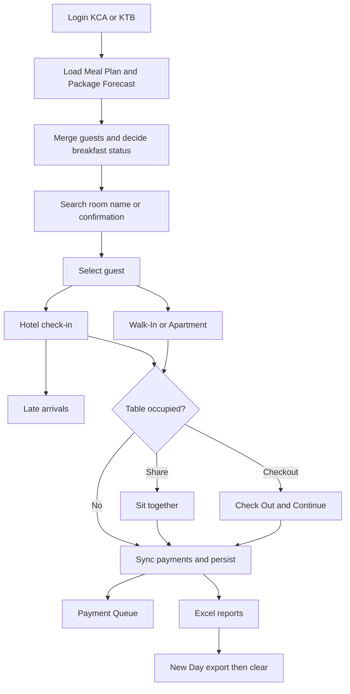
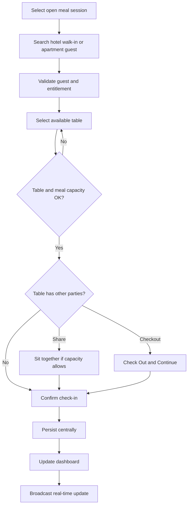
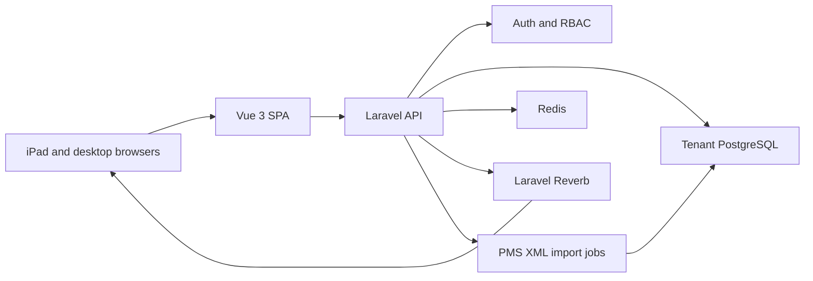

# Business Requirements Document (BRD)

## Restaurant Buffet Operations Platform (RBOP)

| Field | Value |
| --- | --- |
| Product name | Restaurant Buffet Operations Platform (RBOP) |
| Document type | Master business / functional / technical BRD |
| Version | 3.0 (Merged AS-IS + RBOP Target) |
| Audience | Software engineers, QA, product owners, AI coding agents |
| Purpose | Controlled specification for expanding Breakfast Check-in into multi-tenant SaaS while preserving all current capabilities |
| Language | English |
| Source proposal | `RBOP_BRD_v2.md` (left unchanged) |
| Current live Breakfast app | `https://phpcoder7.github.io/breakfast/` |
| Decision on Breakfast features | **Retain and expand** all current Breakfast capabilities inside RBOP |

### Status legend

| Tag | Meaning |
| --- | --- |
| **AS-IS** | Behavior implemented in the current Breakfast Check-in application |
| **TARGET** | Required SaaS behavior for RBOP |
| **TRANSITION** | Compatibility or migration requirement during rebuild |
| **DEFERRED** | Roadmap item outside the first RBOP release |
| **KNOWN GAP** | Current defect, ambiguity, or risk that must be corrected or consciously managed |

### ID namespaces

| Prefix | Scope |
| --- | --- |
| `ASIS-*` | Current Breakfast baseline |
| `RBOP-FR-*` | Target functional requirements |
| `RBOP-NFR-*` | Target non-functional requirements |
| `TRANS-*` | Transition / migration requirements |
| `GAP-*` | Known current gaps |

---

# Part A — Document governance

## A.1 Purpose
This BRD is the master product contract for RBOP. It:
1. Preserves the authoritative AS-IS Breakfast Check-in specification.
2. Defines the TARGET multi-tenant SaaS platform from `RBOP_BRD_v2.md`.
3. Explicitly retains and adapts all current Breakfast workflows, rules, reports, and UX patterns.
4. Provides a phased migration path so AI agents and engineers can rebuild without losing operational parity.

## A.2 Scope summary

### Included in RBOP target release
- Multi-tenant SaaS
- Secure authentication and RBAC
- Restaurant → Floor → Dining Area → Table hierarchy
- Breakfast, Lunch, Dinner meal sessions
- Guest check-in / check-out with real-time updates
- Dashboard and operational reports
- Retention of Breakfast XML import, entitlement, payments, late arrivals, shared seating, FO overrides, Apartment guests, and Excel exports

### Excluded from RBOP first release
- POS
- Inventory
- Full reservation system
- Loyalty
- Payment gateway
- Native mobile applications
- Offline / `file://` station mode as a product requirement

### Deferred roadmap
- Direct PMS API integration (XML remains interim)
- POS integration
- Reservations
- Mobile apps
- Loyalty
- Reserved table status

## A.3 Product objectives
1. Operate buffet check-in for Breakfast, Lunch, and Dinner across multiple tenants/restaurants.
2. Preserve proven Breakfast host workflows and business rules.
3. Provide secure multi-user, multi-device, real-time operations.
4. Enforce table and meal capacity with durable history.
5. Deliver dashboards and accounting/operational reports without destructive day wipes.
6. Migrate KCA/KTB from hard-coded brands into tenant/restaurant configuration.

## A.4 Terminology

| Term | Meaning |
| --- | --- |
| Tenant | Isolated customer organization in SaaS |
| Restaurant | Operating unit inside a tenant |
| Floor | Physical floor inside a restaurant |
| Dining Area | Named seating zone inside a floor (not a hotel guest room) |
| Hotel room number | Guest accommodation identifier from PMS/OPERA |
| Meal type | One of Breakfast, Lunch, Dinner |
| Meal session | One meal type on one business date with open/close times, capacity, menu, status |
| Authentication session | Logged-in user browser/API session |
| Hostess | Operational role for search, check-in/out, table changes |
| Supervisor | Administrative + operational role |
| Waiter | Read-only operational viewer |
| FO | Front Office override capability retained in Breakfast module |
| Entitlement | Included breakfast covers for hotel guests |
| Late arrival | Additional guests joining an active check-in |
| Shared seating | Multiple parties on one table within seating capacity |
| Payment queue | Chargeable check-ins awaiting/paid status |
| AS-IS app | Current static Breakfast Check-in system |

---

# Part B — AS-IS Breakfast baseline (authoritative)

> Everything in Part B documents the **current implemented product**. Rebuilds of the legacy app or Breakfast parity inside RBOP must honor these rules unless a TARGET/TRANSITION statement explicitly changes them.

## B.1 Business context (AS-IS)

### Properties
| Username | Password | Logo | Table config |
| --- | --- | --- | --- |
| `KCA` | `KCAadmin` | `assets/logos/kca.svg` | `tables-kca.txt` |
| `KTB` | `KTBadmin` | `assets/logos/ktb.svg` | `tables-ktb.txt` |

- Username trimmed/uppercased; password exact/case-sensitive.
- Auth in `sessionStorage` key `breakfast-auth-user`.
- Operational state in `localStorage` key `breakfast-checkin-state` (global, not brand-scoped).

### Roles (AS-IS)
| Role | Capabilities |
| --- | --- |
| Restaurant host | Load XML, search, check in, manage tables, mark paid, export |
| FO override | Manual guest + Correct Status |

### Daily lifecycle (AS-IS)
1. Sign in.
2. Load Meal Plan XML + Package Forecast XML.
3. Search and check guests into tables.
4. Manage late arrivals, shared tables, checkout, payments.
5. Export reports.
6. New Day downloads both reports then clears the day.

## B.2 Functional requirements (AS-IS)

### Authentication
| ID | Requirement |
| --- | --- |
| ASIS-AUTH-01 | Login screen before main app |
| ASIS-AUTH-02 | Only configured brand credentials |
| ASIS-AUTH-03 | Store brand username for browser session |
| ASIS-AUTH-04 | Logout clears session auth |
| ASIS-AUTH-05 | Brand logo and table list from logged-in user |
| ASIS-AUTH-06 | Logout does not clear operational day data |

### XML import
| ID | Requirement |
| --- | --- |
| ASIS-XML-01 | Upload Meal Plan XML |
| ASIS-XML-02 | Upload Package Forecast XML |
| ASIS-XML-03 | Reject invalid XML / wrong root / missing columns / empty rows |
| ASIS-XML-04 | Mark loaded + store filename |
| ASIS-XML-05 | Hotel search disabled until both files loaded unless FO override guest selected |
| ASIS-XML-06 | Merge guests when both files present and persist |

### Search / Guest Information
| ID | Requirement |
| --- | --- |
| ASIS-SEARCH-01 | Match room, names, confirmation |
| ASIS-SEARCH-02 | Case-insensitive; room ignores leading zeros |
| ASIS-SEARCH-03 | Max 8 results |
| ASIS-SEARCH-04 | Arrows navigate; Enter prefers exact room |
| ASIS-SEARCH-05 | Selection shows Guest Information and Check In |
| ASIS-SEARCH-06 | Panel shows room, name, adults, children, meal/package, arrival/departure, BF qty, status, Correct Status |
| ASIS-SEARCH-07 | Recent rooms max 6 (memory only) |

### Check-in types
| ID | Requirement |
| --- | --- |
| ASIS-CI-01 | Hotel check-in needs guest + table |
| ASIS-CI-02 | Actual guests default adults + children |
| ASIS-CI-03 | Included entitlement overrun requires confirmation |
| ASIS-CI-04 | Active same-room hotel check-in opens Late Arrivals |
| ASIS-CI-05 | After checkout, same room may check in again |
| ASIS-CI-06 | Walk-In always payment required |
| ASIS-CI-07 | Apartment always payment required; AED 120 |
| ASIS-CI-08 | Manual Guest (FO) works without XMLs |
| ASIS-CI-09 | Correct Status overrides status/qty/meal note |

### Payments
| ID | Requirement |
| --- | --- |
| ASIS-PAY-01 | Queue includes Walk-In, Apartment, hotel `payment`, entitlement overruns |
| ASIS-PAY-02 | AED 150 standard; AED 120 apartment |
| ASIS-PAY-03 | Overrun charges `extraGuests` only |
| ASIS-PAY-04 | Paid marks immediately with timestamp |
| ASIS-PAY-05 | Prices in accounting export, not payment cards |
| ASIS-PAY-06 | Unpaid first, then newest |

### Late arrivals / tables / checkout / today / day
| ID | Requirement |
| --- | --- |
| ASIS-LATE-01 | Late arrivals from duplicate room flow or Guests button |
| ASIS-LATE-02 | Additional guests >= 1 |
| ASIS-LATE-03 | Recalculate extras/entitlement; optional table update |
| ASIS-LATE-04 | Paid status resets on late arrivals |
| ASIS-TBL-01 | Table identity case/space-insensitive |
| ASIS-TBL-02 | Occupied table prompt: Cancel / Sit together / Check Out & Continue |
| ASIS-TBL-03 | Sit together keeps existing parties |
| ASIS-TBL-04 | Check Out & Continue checks out all active occupants |
| ASIS-TBL-05 | Tables board Available green / Occupied red |
| ASIS-TBL-06 | Available click prefills Check In table |
| ASIS-TBL-07 | Occupied click shows occupants |
| ASIS-TBL-08 | Change table from Today’s / Payment cards |
| ASIS-TBL-09 | Check Out confirms and sets `checkedOut` + `checkedOutAt` |
| ASIS-TBL-10 | History retained after checkout |
| ASIS-TODAY-01 | Cards show time/room/name/status/table/guests/type |
| ASIS-TODAY-02 | Active actions: Change Table, Guests, Check Out |
| ASIS-TODAY-03 | Checked-out muted with Out time |
| ASIS-TODAY-04 | Filters: table; room/name |
| ASIS-TODAY-05 | Card click shows Guest Information |
| ASIS-TODAY-06 | Stats use full day, not filter |
| ASIS-DAY-01 | New Day confirms then downloads both reports |
| ASIS-DAY-02 | Export failure cancels clear |
| ASIS-DAY-03 | Clear guests/check-ins/payments/XML; auth remains |
| ASIS-EXP-01 | Export Breakfast Report |
| ASIS-EXP-02 | Export Accounting Report |

## B.3 Business rules (AS-IS)

### Package codes
Included: `BFAAD`, `BFAIN`, `BFCAD`, `BFCIN`, `UPSBB1`, `WEB_BFSA`, `BB`, `CLB`  
Payment: `RO`

### Status precedence
1. Meal plan `RO` => `payment`
2. Else included code in meal/products => `included`
3. Else any code => `unknown`
4. Else => `unknown`

### Entitlement
```text
breakfastQuantity = package breakfast qty > 0 ? that qty : adults + children
extraGuests = max(0, actualGuests - breakfastQuantity)
entitlementExceeded = (status == included) AND (extraGuests > 0)
```

### Pricing
| Case | Unit | Qty |
| --- | --- | --- |
| Apartment | 120 | actual or adults+children |
| Walk-In / hotel payment | 150 | actual or adults+children |
| Entitlement overrun | 150 | extraGuests |

### Occupancy / payments / history
- Occupied = active check-in on normalized table.
- Multiple parties may share a table.
- Payment list regenerated via filter/map/sort.
- Checkout frees table; keeps history and payment rows.

## B.4 AS-IS data model

### Persistence
| Store | Key | Contents |
| --- | --- | --- |
| `sessionStorage` | `breakfast-auth-user` | Brand username |
| `localStorage` | `breakfast-checkin-state` | Day snapshot |

Snapshot valid only when `serviceDate === today`.

```json
{
  "guests": [],
  "checkIns": [],
  "paymentList": [],
  "filesLoaded": { "mealPlan": false, "packageForecast": false },
  "fileNames": { "mealPlan": "", "packageForecast": "" },
  "rawData": { "mealPlan": [], "packageForecast": [] },
  "serviceDate": "YYYY-MM-DD"
}
```

Transient: selected guest, search state, recent rooms, tab/view, modal/forms.

### Guest / CheckIn / Payment fields
Retain all existing fields documented previously:
- Guest: identity, stay, meal/products, breakfastStatus/Quantity, guestType, statusOverride
- CheckIn: table, actualGuests, extras, paid/paidAt, checkedOut/checkedOutAt, lateArrivalAdded
- Payment: reason, chargeableGuests, unitPriceAed, amountAed, paid/paidAt

## B.5 AS-IS input/output contracts

### Meal Plan XML
- Root `RS`
- Rowset namespace `urn:schemas-microsoft-com:xml-analysis:rowset`, element `R`
- Required headings: Room, Confirmation, Meal Plan
- Optional: names, arrival/departure, adults/children

### Package Forecast XML
- Root `PKGFORECAST`
- Blocks `G_RESV_DETAILS` / `G_PRODUCT_GROUP`
- Fields include confirmation, room, names, products, qty, status, dates, rate
- Status captured but not filtered

### Merge
1. Aggregate forecast by confirmation and room.
2. Match meal plan by confirmation then room.
3. Meal plan wins identity/occupancy/meal plan; package fills products/qty.
4. Unmatched forecast rows become searchable guests.

### Table files
- `tables-kca.txt`, `tables-ktb.txt` comma-separated
- Bundled via esbuild `--loader:.txt=text`
- KTB currently populated; KCA may be empty (**KNOWN GAP**)

### Excel
- `breakfast-report-YYYY-MM-DD.xlsx` / sheet `Breakfast Report`
- `breakfast-accounting-YYYY-MM-DD.xlsx` / sheet `Accounting`
- Exact columns as current implementation (including Checked Out / Check Out Time and AED accounting columns)

## B.6 AS-IS UX
- Login + main shell with Search/Guest Information and tabs: Check In, Today’s Check-ins, Payment Queue, Tables
- Responsive iPad/phone behaviors, status colors, card actions, keyboard shortcuts, modals
- Touch-friendly host station UX is a retained design principle for RBOP

## B.7 AS-IS technical baseline
- Static SPA, `js/app.bundle.js` IIFE, modules under `js/`
- SheetJS + Font Awesome local; Tailwind CDN
- Build: `npx esbuild js/app.js --bundle --format=iife --loader:.txt=text --outfile=js/app.bundle.js`
- GitHub Pages deploy; SW cache versioned manually
- Offline/`file://` supported for legacy app only

## B.8 AS-IS known gaps
| ID | Topic | Fact | TARGET disposition |
| --- | --- | --- | --- |
| GAP-01 | Unknown packages | Flagged but not queued | Corrected in RBOP: FO review + exception/payment workflow |
| GAP-02 | Duplicate wording | README vs Late Arrivals | Late Arrivals is canonical |
| GAP-03 | Cross-brand storage | Global localStorage | Replaced by tenant DB isolation |
| GAP-04 | Empty KCA tables | Board empty | Migrated to managed tables; seed required |
| GAP-05 | Reservation status unused | Imported only | Configurable filter in TARGET |
| GAP-06 | Stats vs queue | Can diverge | Dashboard formulas must reconcile |
| GAP-07 | Manual bundle | No CI rebuild | Replaced by Laravel/Vue build pipeline |
| GAP-08 | SW cache bump | Manual | Not applicable to SaaS target |
| GAP-09 | CDN cold offline | Styling gap | Offline excluded from TARGET |
| GAP-10 | Modal promises | Cancel unresolved | Must resolve cancel paths |
| GAP-11 | No tests | Missing | Required in TARGET |
| GAP-12 | Client passwords | Visible | Replaced by secure auth |



---

# Part C — TARGET RBOP product

## C.1 Platform and tenancy

| ID | Requirement |
| --- | --- |
| RBOP-FR-TEN-01 | System shall be multi-tenant SaaS |
| RBOP-FR-TEN-02 | Every user belongs to exactly one tenant |
| RBOP-FR-TEN-03 | Tenant data shall be isolated; Tenant A cannot access Tenant B data via UI, API, events, or reports |
| RBOP-FR-TEN-04 | Each tenant shall have a dedicated PostgreSQL database |
| RBOP-FR-TEN-05 | KCA and KTB shall migrate to tenant/restaurant records (not hard-coded logins) |
| RBOP-FR-TEN-06 | A tenant may operate one or more restaurants |

## C.2 Restaurant hierarchy

Hierarchy:
```text
Tenant
  └── Restaurant
        └── Floor
              └── Dining Area
                    └── Table
```

| ID | Requirement |
| --- | --- |
| RBOP-FR-ORG-01 | Supervisors can configure floors, dining areas, and tables |
| RBOP-FR-ORG-02 | Each table has unique identity within restaurant, display number, seating capacity, and operational status |
| RBOP-FR-ORG-03 | Dining Area naming must never be confused with hotel room numbers |
| RBOP-FR-ORG-04 | Initial table lists may be imported from legacy `tables-*.txt` files during migration |

## C.3 Meal sessions

Exactly three meal types: Breakfast, Lunch, Dinner.

Each meal session includes:
- Business date
- Meal type
- Opening time
- Closing time
- Capacity (total covers for the session)
- Menu reference/text
- Status: Planned / Open / Closed

| ID | Requirement |
| --- | --- |
| RBOP-FR-MEAL-01 | Every check-in belongs to one meal session |
| RBOP-FR-MEAL-02 | Closed sessions reject new check-ins |
| RBOP-FR-MEAL-03 | Hostess/Supervisor must select current meal session before operational check-in |
| RBOP-FR-MEAL-04 | Capacity monitoring shows used/remaining covers and percentage |
| RBOP-FR-MEAL-05 | Meal capacity is concurrent + cumulative covers; new check-in rejected when remaining covers < requested actual guests |

## C.4 Guest types (TARGET retained set)

| Type | Retained from AS-IS | Notes |
| --- | --- | --- |
| Hotel Guest | Yes | PMS/XML-backed |
| Walk-in Guest | Yes | Always chargeable by default |
| Apartment Guest | Yes | Retained despite omission in RBOP v2 draft |

## C.5 Roles and permissions

| Capability | Supervisor | Hostess | Waiter |
| --- | --- | --- | --- |
| Configure restaurant hierarchy | Yes | No | No |
| Manage users/roles | Yes | No | No |
| Open/close meal sessions | Yes | No | No |
| Import PMS/XML | Yes | No | No |
| FO Manual Guest / Correct Status | Yes | Yes | No |
| Search guests | Yes | Yes | View only |
| Check-in / Check-out | Yes | Yes | No |
| Late arrivals | Yes | Yes | No |
| Change tables / shared seating decisions | Yes | Yes | No |
| Set table Cleaning / Out of Service | Yes | Yes | No |
| Payment Queue mark paid | Yes | Yes | No |
| Dashboard | Yes | Yes | Yes |
| Reports/exports | Yes | Yes | No |
| View tables/guests live | Yes | Yes | Yes |

Permissions are enforced server-side (Spatie Permission), not only in UI.

## C.6 Table status and capacity

Statuses:
- Available
- Occupied
- Cleaning
- Out of Service
- Reserved (**DEFERRED**)

| ID | Requirement |
| --- | --- |
| RBOP-FR-TBL-01 | Available/Occupied derived from active check-ins unless overridden by Cleaning/Out of Service |
| RBOP-FR-TBL-02 | Cleaning and Out of Service reject new check-ins |
| RBOP-FR-TBL-03 | Aggregate active guests on a table cannot exceed seating capacity |
| RBOP-FR-TBL-04 | Shared seating (multiple parties) is allowed only within capacity |
| RBOP-FR-TBL-05 | Occupied-table choices retain Cancel / Sit together / Check Out & Continue when capacity allows |
| RBOP-FR-TBL-06 | One active party/guest identity cannot be checked into two tables simultaneously |
| RBOP-FR-TBL-07 | Free-text unconfigured table numbers are not allowed in TARGET; tables must exist as entities |

## C.7 Retained Breakfast module inside RBOP

These AS-IS capabilities remain **required** for Breakfast (and adaptable to Lunch/Dinner where relevant):

| Domain | Retained behavior |
| --- | --- |
| PMS ingestion | Meal Plan + Package Forecast XML as interim import |
| Entitlement | Package codes, RO precedence, BF qty, extras, FO Correct Status |
| Guest ops | Hotel, Walk-In, Apartment, Manual Guest |
| Seating | Late Arrivals, shared seating, table change, checkout history |
| UX | Fast search, Guest Information, Today’s list filters/cards |
| Payments | Payment Queue, paid timestamps, AED defaults 150/120 (tenant-configurable) |
| Exports | Breakfast Report + Accounting Report column contracts retained |
| Unknown packages | **Corrected:** require FO review and appear in exception/payment workflow |

| ID | Requirement |
| --- | --- |
| RBOP-FR-BF-01 | Breakfast module shall preserve AS-IS entitlement and pricing semantics |
| RBOP-FR-BF-02 | XML import remains available until direct PMS integration ships |
| RBOP-FR-BF-03 | Unknown status requires FO review and is included in exception/payment handling |
| RBOP-FR-BF-04 | Late Arrivals remain the duplicate active-room workflow |
| RBOP-FR-BF-05 | Payment Queue remains operational even though POS/payment gateway are excluded |
| RBOP-FR-BF-06 | Accounting Summary report includes Payment Queue data |

## C.8 Target check-in workflow



## C.9 Dashboard (TARGET)

| Metric | Formula / definition |
| --- | --- |
| Total Guests | Sum of `actualGuests` for active check-ins in current meal session |
| Walk-in Guests | Active walk-in actual guests |
| Hotel Guests | Active hotel actual guests |
| Apartment Guests | Active apartment actual guests |
| Available Tables | Tables in Available status and not occupied |
| Occupied Tables | Tables with >= 1 active party or Occupied status |
| Capacity % | `sessionActiveGuests / sessionCapacity * 100` |
| Average Guests per Table | `sessionActiveGuests / occupiedTables` (0 if none) |
| Current Meal | Selected open meal session |
| Live Floor Status | Floor/dining-area grid of table statuses |

Dashboard must reconcile with persisted check-ins within the tenant/restaurant/session scope.

## C.10 Reports (TARGET)

| Report | Scope |
| --- | --- |
| Daily Summary | Business date across meals |
| Meal Summary | One meal session |
| Guest Statistics | Hotel / Walk-in / Apartment / included / payment / unknown |
| Table Utilization | Occupancy duration, turns, capacity use |
| Accounting Summary | Chargeable covers, amounts, paid/unpaid |
| Breakfast Report (retained) | Existing column contract |
| Accounting Excel (retained) | Existing column contract |

Exports never delete history. Closing a meal session or business day is non-destructive.

## C.11 Replaced operating assumptions

| AS-IS | TARGET |
| --- | --- |
| `localStorage` day snapshot | PostgreSQL tenant DB |
| Hard-coded credentials | Secure Laravel auth + RBAC |
| Destructive New Day | Durable business date + meal open/close |
| Free-text/config tables | Managed table entities |
| Static GitHub Pages runtime | Vue 3 + Laravel API + Postgres + Redis + Reverb |
| Offline/`file://` product mode | Excluded from TARGET; legacy note only |

---

# Part D — Target data model and architecture

## D.1 Core entities

| Entity | Key fields / notes |
| --- | --- |
| Tenant | id, name, status, settings |
| Restaurant | tenant_id, code (KCA/KTB…), name, branding, pricing defaults |
| Floor | restaurant_id, name, sort_order |
| DiningArea | floor_id, name, sort_order |
| Table | dining_area_id, number, capacity, status, active |
| MealSession | restaurant_id, business_date, meal_type, open_at, close_at, capacity, menu, status |
| User | tenant_id, name, email/username, password hash, status |
| Role / Permission | Spatie models; restaurant-scoped abilities as needed |
| GuestProfile | hotel room, confirmation, names, stay, PMS fields |
| Party / CheckIn | meal_session_id, table_id, guest refs, guest_type, actual_guests, entitlement fields, status, paid fields, checked_out_at |
| AccountingEntry | derived/persisted payment row linked to check-in |
| PMSImport | file metadata, type, checksum, imported_by, result |
| OperationalEvent | audit/real-time outbox for check-in/out/table/status changes |

Ownership: every operational row carries `tenant_id` (and restaurant where applicable). Soft-delete/audit timestamps required on mutating entities.

## D.2 Mandated stack (TARGET)

### Frontend
- Vue 3
- TypeScript
- Pinia
- Vue Router
- Tailwind CSS v4
- shadcn-vue

### Backend
- Laravel
- PostgreSQL (database per tenant)
- Spatie Multitenancy
- Spatie Permission
- Laravel Reverb
- Redis

## D.3 Target architecture



## D.4 Real-time requirements
| ID | Requirement |
| --- | --- |
| RBOP-FR-RT-01 | Check-in/out, table status, and payment changes broadcast to connected clients in the same restaurant |
| RBOP-FR-RT-02 | Target propagation latency under 2 seconds on healthy network |
| RBOP-FR-RT-03 | Committed DB writes must succeed even if Redis/Reverb is temporarily unavailable |
| RBOP-FR-RT-04 | Clients reconnect and resynchronize missed state |

## D.5 Non-functional requirements (TARGET)

| ID | Category | Requirement |
| --- | --- | --- |
| RBOP-NFR-01 | UX | Responsive iPad-optimized UI with large touch targets |
| RBOP-NFR-02 | Security | Secure authentication, hashed passwords, session expiry, server-side authorization |
| RBOP-NFR-03 | Isolation | Strict tenant data isolation |
| RBOP-NFR-04 | Availability | High availability design; documented RTO/RPO |
| RBOP-NFR-05 | Performance | Search and table board remain interactive under normal concurrent hostess load |
| RBOP-NFR-06 | Audit | Mutating actions produce audit/operational events |
| RBOP-NFR-07 | Privacy | PII protected; XML imports not publicly exposed |
| RBOP-NFR-08 | Reliability | No data loss on client refresh; durable server persistence |
| RBOP-NFR-09 | Maintainability | Automated tests for entitlement, capacity, permissions, imports, reports |
| RBOP-NFR-10 | Backup | Automated tenant DB backups and restore drills |

---

# Part E — Transition specification

## E.1 Disposition principles
1. Preserve Breakfast operational parity before expanding to Lunch/Dinner.
2. Do not drop AS-IS features omitted by the short RBOP v2 draft.
3. Replace only incompatible assumptions (storage, auth, offline, destructive New Day).
4. Treat `RBOP_BRD_v2.md` as the source proposal; this master BRD is the controlled contract.

## E.2 Requirement disposition matrix (selected)

| AS-IS ID | Disposition | TARGET / TRANS ID | Notes |
| --- | --- | --- | --- |
| ASIS-AUTH-* | Replace | RBOP-FR-TEN / RBAC | Secure users/roles |
| ASIS-XML-* | Retain | RBOP-FR-BF-02 | Interim PMS ingestion |
| ASIS-SEARCH-* | Retain | Hostess UX | Keep keyboard/fast search |
| ASIS-CI-* | Retain/Adapt | Meal session + table entities | Add session/capacity checks |
| ASIS-PAY-* | Retain | Accounting + Payment Queue | No POS yet |
| ASIS-LATE-* | Retain | Hostess workflow | Same semantics |
| ASIS-TBL-02/03/04 | Retain/Adapt | RBOP-FR-TBL-03/05 | Capacity gate added |
| ASIS-DAY-* | Replace | Meal close + durable history | No wipe |
| ASIS-EXP-* | Retain | Reports | Keep Excel contracts |
| GAP-01 unknown | Change | RBOP-FR-BF-03 | Must enter exception/payment flow |
| Offline/file mode | Retire as product | TRANS-LEGACY-01 | Documented legacy only |

## E.3 Phased delivery

| Phase | Deliverable |
| --- | --- |
| 1 | SaaS tenancy, auth, RBAC foundation |
| 2 | Restaurant hierarchy + migrate KCA/KTB tables/branding |
| 3 | Server-backed Breakfast parity (XML, entitlement, payments, late arrivals, shared seating, exports) |
| 4 | Meal sessions, capacities, explicit table statuses, real-time sync |
| 5 | Lunch/Dinner, dashboards, target summary reports |
| 6 | Deferred: direct PMS, POS, reservations, mobile, loyalty |

## E.4 Transition requirements

| ID | Requirement |
| --- | --- |
| TRANS-01 | Provide migration scripts/import for KCA/KTB restaurants, logos, and table lists |
| TRANS-02 | Map legacy check-in/payment field semantics into target entities |
| TRANS-03 | Preserve Excel column contracts during and after migration |
| TRANS-04 | Until Phase 3 complete, do not remove any AS-IS Breakfast capability relied on by hosts |
| TRANS-05 | Document cutover plan: pilot one restaurant, then second |
| TRANS-LEGACY-01 | Legacy static app remains reference implementation until RBOP Breakfast parity is accepted |

## E.5 Acceptance criteria (TARGET + parity)

### Platform
- Tenant A cannot read Tenant B data through any interface.
- Supervisor/Hostess/Waiter permissions enforced server-side.
- Password credentials are not hard-coded in frontend.

### Operations
- Closed meal session rejects check-in.
- Every check-in stores tenant, restaurant, meal session, table.
- Aggregate table guests cannot exceed capacity.
- Cleaning/Out of Service tables reject check-in.
- Concurrent clients cannot overbook beyond capacity.
- Real-time update appears on second client within 2 seconds when infrastructure healthy.
- Redis/Reverb outage does not lose committed check-ins.

### Breakfast parity
- XML import/merge/entitlement codes behave as AS-IS.
- Late Arrivals, shared seating, Apartment pricing, Payment Queue, and Excel columns remain available.
- Unknown packages require FO review and appear in exception/payment handling.
- Checkout retains history; no destructive New Day wipe in TARGET.

### Analytics
- Dashboard metrics reconcile with session check-ins.
- Daily/Meal/Accounting reports reconcile with source rows and tenant scope.

---

# Part F — AI agent rebuild guidance

Any AI agent working from this BRD SHALL:

1. Treat this file as the master contract; use `RBOP_BRD_v2.md` only as the original proposal.
2. Preserve all AS-IS Breakfast business rules unless a TARGET/TRANSITION item explicitly changes them.
3. Build TARGET on Vue 3 + Laravel + PostgreSQL tenant DBs + Redis + Reverb.
4. Keep UI optimized for iPad hostess workflows.
5. Maintain tenant isolation and server-side role permissions.
6. Preserve meal-session workflow and real-time synchronization.
7. Retain XML interim import, entitlement, payments, late arrivals, shared seating, Apartment guests, and Excel exports.
8. Not invent POS, payment gateway, offline mode, or mobile apps in the first release.
9. Prefer durable history over destructive New Day clearing.
10. Implement tests for entitlement, capacity, permissions, imports, and reports before calling parity complete.

---

# Part G — Appendix

## G.1 Current repository map (AS-IS)
```text
index.html
style.css
manifest.webmanifest
service-worker.js
tables-kca.txt
tables-ktb.txt
js/app.js / app.bundle.js / auth.js / xmlParser.js / mergeData.js
js/search.js / checkin.js / payment.js / export.js / ui.js / tables.js / utils.js
vendor/
assets/
.github/workflows/pages.yml
README.md
BRD.md                 This master document
RBOP_BRD_v2.md         Source expansion proposal (unchanged)
```

## G.2 Decision log

| Decision | Choice | Rationale |
| --- | --- | --- |
| Migration scope | Retain and expand current Breakfast features | Operations already depend on XML, entitlement, payments, late arrivals, Apartment |
| Dining zone naming | Dining Area | Avoid confusion with hotel room numbers |
| Shared seating | Allowed within table capacity | Matches current Sit together need |
| Unknown packages | FO review + exception/payment | Corrects GAP-01 |
| Offline mode | Excluded from TARGET | SaaS real-time platform |
| New Day wipe | Retired | Durable reporting history |
| PMS | XML interim; API deferred | Continuity without waiting for PMS project |

---

*End of master BRD v3.0*
