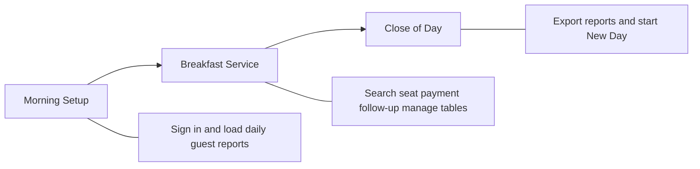

# Breakfast Operations Management System

### Executive Brief

**Digital Breakfast Operations Solution**

 

**Prepared for**

General Manager  
Kempinski The Boulevard

 

**Prepared by**

Mohamed Mekky  
Restaurant Supervisor

 

**2026**

---

**Document type:** Executive brief for hotel leadership  
**Audience:** General Manager · Food & Beverage Director · Restaurant Manager · Operations Manager  
**Properties covered:** KCA · KTB  
**Focus:** Operational value, payment follow-up, and management visibility

---

## 1. Executive Summary

Breakfast Operations Management System is the restaurant’s digital host stand for morning buffet service.

It tells staff—instantly—whether a guest has breakfast included, which table they are at, which guests require payment follow-up, and what happened during today’s service.

**For the hotel, that means:**

- Faster, calmer guest arrivals at breakfast  
- Fewer missed payment follow-ups on walk-ins, room-only guests, apartments, and extra covers  
- Live control of tables and covers during service  
- Clean end-of-day reports for restaurant and finance  

One station replaces paper lists, handwritten seating notes, and informal payment tracking.

---

## 2. Key Operational Capabilities

| Capability | Operational Value |
|------------|-------------------|
| **Guest Entitlement Verification** | Prevents incorrect breakfast access |
| **Digital Check-in** | Faster guest processing |
| **Table Management** | Better seating utilization |
| **Payment Tracking** | Supports payment follow-up |
| **Daily Reporting** | Supports management decisions |

---

## 3. Background

Breakfast is one of the hotel’s busiest daily guest touchpoints. Guests arrive in waves. Packages differ. Walk-ins and apartment guests must be handled correctly for payment follow-up. The entrance must feel effortless—never rushed or confused.

Breakfast Operations Management System supports the restaurant host at that entrance. Staff sign in for the property (KCA or KTB), load the two daily guest reports from the hotel property management system, and run the full breakfast shift from a single screen.

This brief describes only the system as it operates today.

---

## 4. Why This System Was Developed

The breakfast entrance is one of the busiest operational areas in any hotel.

During peak hours, hosts must identify guest entitlements, assign tables, manage payments, and maintain smooth guest flow—all within seconds.

Traditional paper-based processes make this difficult, increasing waiting times, operational pressure, and the risk of missed payment follow-up.

Breakfast Operations Management System was developed to digitalize this operational process while preserving the existing hotel workflow: staff continue to use the hotel’s daily guest reports, and the host stand remains the center of service—now with speed, clarity, and control.

---

## 5. The Problems It Replaces

| Without this system | Business impact |
|---------------------|-----------------|
| Checking separate printed guest reports | Slow entitlement decisions at peak hours |
| Paper seating lists and verbal notes | Lost records and weak end-of-shift visibility |
| Unclear “included” vs “pay” guests | Guest disputes and weak payment accountability |
| No structured payment list | Missed walk-in, apartment, and extra-cover payment follow-up |
| Guessing which tables are free | Congestion and poor seating decisions |
| Paper reconciliation after service | Extra work for F&B and accounting |

Breakfast Operations Management System puts entitlement, seating, payments, and reporting in one place at the host stand.

---

## 6. What Leadership Should Expect

The system is designed to deliver:

1. **Immediate entitlement clarity** — included, payment required, or needs Front Office review  
2. **Faster arrivals** — search by room, guest name, or confirmation  
3. **A complete seating record** — table, guest count, and time for every check-in  
4. **Payment follow-up** — walk-ins, apartments, room-only guests, and extra covers tracked until marked Paid  
5. **Live table control** — available vs occupied at a glance  
6. **Front Office support** when a guest is missing or status needs correction  
7. **Ready-to-use reports** for operations and accounting at close of service  

---

## 7. How the Station Works

After sign-in, the host works from one workspace:

| Area | What it does for the hotel |
|------|----------------------------|
| **Room Search & Guest Information** | Find the guest and confirm breakfast status before seating |
| **Check In** | Assign a table and record the arrival |
| **Today’s Check-ins** | Full digital list of everyone seated today |
| **Payment Queue** | Guests who require payment follow-up |
| **Tables** | Live available / occupied board |
| **Reports & New Day** | Export Excel files and prepare for tomorrow |

**Who uses it**

- **Restaurant host** — primary operator for the full breakfast shift  
- **Front Office support** — when a guest is missing from the daily list or breakfast status needs correction  

All signed-in staff share the same capabilities. There are no separate supervisor or waiter logins.

---

## 8. Main Capabilities — Business Value

### Guest recognition and entitlement

Staff load the hotel’s daily Meal Plan and Package Forecast reports once at opening. The system combines them into one guest list and shows whether breakfast is:

- **Included**  
- **Payment required** (including Room Only)  
- **Needs review** (unrecognized package — flagged for Front Office correction before charging)

Hosts search by room, name, or confirmation and see party size, package, and entitlement before seating. Recent rooms stay available for quick return lookups.

**Business value:** Faster arrivals, fewer entitlement disputes, less guessing at the door.

---

### Seating and floor control

Hotel guests are checked in with table number and guest count. The Tables board shows available and occupied tables. Hosts can share a table between parties, change tables, or free a table when guests leave—while keeping the day’s history.

Late arrivals joining a room already seated are added to the same record, so party size and payment stay accurate.

**Business value:** Better table turns, clearer floor picture, fewer seating mistakes during peak.

**Property note:** KTB has restaurant tables configured. KCA’s table list is not yet configured, so table-board use at KCA depends on completing that setup.

---

### Payment follow-up

Guests who require payment follow-up are tracked automatically, including:

- Walk-in guests  
- Apartment guests  
- Hotel guests with payment-required status  
- Extra guests beyond package entitlement  

Unpaid items appear first in the Payment Queue. Staff mark each as **Paid** when payment has been completed—supporting clear follow-up during and after service.

Unrecognized packages are flagged for attention but are **not** added to the payment list until Front Office corrects the status—protecting both guest experience and operational accuracy.

**Business value:** Fewer missed payment cases; clearer follow-up during and after service.

---

### Exception handling

When daily reports are incomplete or a guest is missing, staff can:

- Enter a **Manual Guest** with Front Office guidance  
- **Correct breakfast status** when the package needs adjustment  

Overrides appear in the Breakfast Report for management visibility.

**Business value:** Service continues without losing control or accountability.

---

### Live supervision and close of day

During service, managers can see check-in counts, unpaid payments, included covers, and payment-required covers at a glance.

At close—or on demand—the station produces:

- **Breakfast Report** — who was seated, when, where, entitlement, guest type, Front Office corrections, checkout times  
- **Accounting Report** — who requires payment follow-up, why, how many covers, and paid or unpaid status  

**New Day** downloads both reports, then clears the day for the next service. If reports fail to download, the day is not cleared—protecting the record.

The station also works on tablet or phone, and can continue if the network is unavailable after opening.

**Business value:** Real-time oversight during service; clean files for F&B and finance afterward.

---

## 9. Daily Workflow

**Morning**

1. Sign in for the property  
2. Load both daily guest reports  
3. Confirm the guest list is ready  

**During service**

4. Search guest → confirm entitlement → assign table → check in  
5. Handle walk-ins, apartments, late arrivals, and extra covers as needed  
6. Monitor Today’s Check-ins, Payment Queue, and Tables  
7. Complete payment follow-up and mark items Paid  
8. Check out guests when they leave to free tables  

**Close**

9. Export Breakfast and Accounting reports  
10. Start New Day for tomorrow’s service  

---

## 10. Problems Solved

| Problem | Outcome with Breakfast Operations Management System |
|---------|----------------------------------|
| Slow entitlement checks | Instant included / pay / needs-review status |
| Peak-hour delays at the entrance | Fast room and name lookup |
| Paper seating lists | Full digital day record |
| Missed breakfast payment cases | Automatic payment tracking and follow-up |
| Unclear table availability | Live available / occupied board |
| Extra covers beyond entitlement unnoticed | Confirmation and payment follow-up for extra covers |
| Late-joining guests mismanaged | Controlled late-arrival update |
| End-of-day reconciliation from paper | Excel reports ready for F&B and finance |

---

## 11. Management Outcomes

The General Manager’s question is simple: **What will the hotel gain?**

The outcomes below are the expected operational results of using Breakfast Operations Management System consistently at the host stand. They are expressed as management outcomes—not feature lists.

### Expected Operational Outcomes

| Expected outcome | What leadership should see |
|------------------|----------------------------|
| **Faster breakfast check-in** | Guests are identified and seated more quickly at peak arrival times |
| **Better payment accountability** | Walk-ins, apartments, room-only guests, and extra covers remain visible until marked Paid |
| **Improved table utilization** | Available and occupied tables are visible in real time, supporting smoother seating |
| **Reduced operational errors** | Fewer entitlement mistakes, missed payment cases, and lost seating notes |
| **Improved reporting accuracy** | End-of-day Breakfast and Accounting reports replace informal paper reconciliation |
| **Better guest experience** | Shorter waits, clearer decisions at the door, and fewer entitlement disputes |

### Outcomes by stakeholder

| Stakeholder | Expected management outcome |
|-------------|-----------------------------|
| **Operations** | Standardized host-stand process; clearer floor control; cleaner day close |
| **Management** | Live visibility of covers and unpaid items; stronger payment follow-up oversight |
| **Guests** | Faster recognition and seating; more consistent service at the entrance |
| **Staff** | One workstation for the full shift; less paperwork; clearer handling of exceptions |

These outcomes become visible through consistent use at the host stand—delivering measurable control over breakfast service from open to close.

---

## 12. Reporting & Visibility

**During service, leadership can see:**

- How many guests have checked in  
- How many payments remain unpaid  
- How many breakfasts are included vs payment required  
- Which tables are free or occupied  
- The full seating list, filterable by table or guest  

**After service, leadership receives:**

| Report | Management use |
|--------|----------------|
| **Breakfast Report** | Operational review of the day’s service |
| **Accounting Report** | Payment follow-up and operational review |

---

## 13. Operational Impact

Breakfast Operations Management System turns a paper-heavy entrance into a controlled digital service point.

**Effort:** A short morning setup—sign in and load two daily reports.  
**Return:** Faster arrivals, clearer payment follow-up, live supervision, and ready reports at close.

**Service quality:** Guests are recognized faster. Staff spend less time hunting lists and more time managing the floor. Managers see the shift as it happens—and hold a clean record afterward.

**How it should be supervised today**

- One property login is shared; supervise access as you would any host-stand tool  
- Day records live on the station for that day—export reports before relying on them elsewhere  
- Unrecognized packages require Front Office correction before payment follow-up  
- Complete KCA’s table list if that property needs full table-board use  

---

## 14. Contribution to Hotel Digital Transformation

This is not simply a restaurant tool. It represents an important step in the hotel’s digital transformation of morning F&B operations.

Breakfast Operations Management System moves one of the property’s highest-volume guest touchpoints from informal paper processes to a controlled digital workflow—while keeping the hotel’s existing guest-report process intact.

| Digital transformation outcome | What it means for the hotel |
|--------------------------------|-----------------------------|
| **Standardized breakfast operations** | The same clear process every morning: load reports, search, seat, collect, close |
| **Reduced dependency on paper** | Entitlement, seating, payments, and day history live at the host stand—not in notebooks |
| **Centralized operational information** | One place for guest status, tables, check-ins, and payment follow-up during service |
| **Better operational transparency** | Live counts and a complete day record visible to F&B leadership |
| **Better decision making** | End-of-day Breakfast and Accounting reports support review, coaching, and payment follow-up |

For hotel leadership, this initiative supports operational excellence: faster service, clearer payment accountability, and management visibility—delivered as a measurable step in digital transformation at the breakfast entrance.

---

## 15. Conclusion

Breakfast Operations Management System transforms one of the hotel’s busiest daily operations into a controlled, transparent, and digitally managed process.

By improving guest flow, strengthening payment follow-up, and providing real-time operational visibility, the system supports both service excellence and better management decision-making.

**For the General Manager, the expected return is clear:**

- Faster breakfast check-in  
- Better payment accountability  
- Improved table utilization  
- Reduced operational errors  
- Improved reporting accuracy  
- Better guest experience  
- A concrete advance in hotel digital transformation  

This is the operational value of Breakfast Operations Management System: excellence at the entrance, operational accountability, and clarity for leadership.

---

*Breakfast Operations Management System — Executive Brief · 2026*
